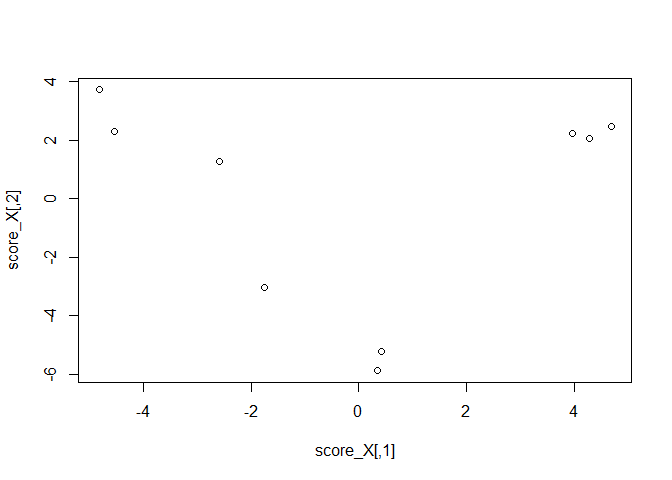

PLS-ROG
================

### お知らせ

>   - このリポジトリは、今後loadingsリポジトリに統合予定です。
>   - This repository will be integrated into the "loadings" (https://github.com/hiroyukiyamamoto/loadings) in the future.


### PLS-ROGの計算と結果

>   - 引数は、データ行列、群情報、平滑化パラメーターの順に設定する
>   - score\_XがPLS-ROGのスコア
>   - Rはscore\_Yとデータ行列Xの各変数の相関係数(PLS-ROG loading)
>   - Pは各列がそれぞれの成分のPLS-ROG loadingのp-value

``` r
plsrog <- plsrog(X, Z$Y, 0.999)

score_X <- plsrog[[1]] # score for X
score_Y <- plsrog[[2]] # score for Y
Wx <- plsrog[[3]] # weight vector for X
Wy <- plsrog[[4]] # weight vector for Y
R <- plsrog[[5]] # factor loading for X
P <- plsrog[[6]] # p-value of factor loading for X

plot(score_X)
```

<!-- -->
